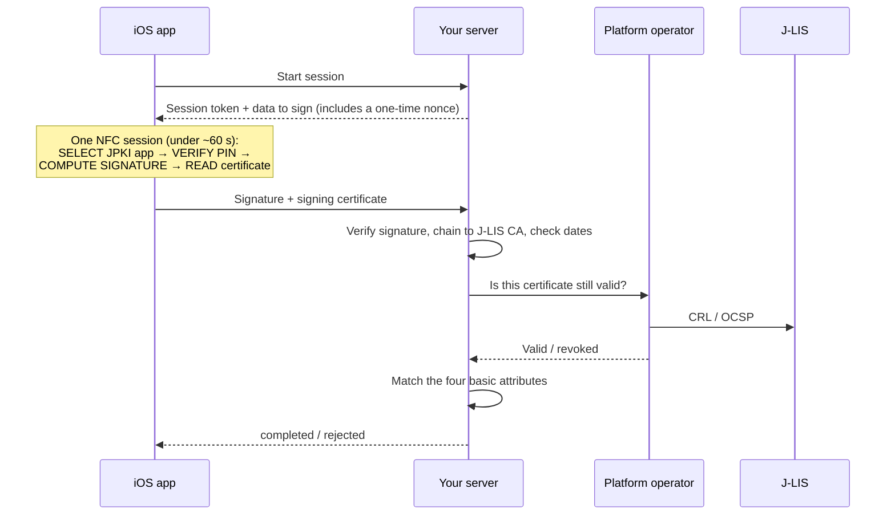

# ekyc-jp

**English** · [日本語](README.md)

A Claude Code plugin (19 skills) for building **My Number Card / JPKI identity verification
(eKYC)** into an iOS app, and the server that verifies it. The app reads the card's IC chip
directly with CoreNFC + APDU, with no vendor SDK.

With the plugin installed, Claude Code answers from the specification and the law, not from a
plausible guess. When a value is not confirmed, the skill says so.

## What you can do with it

- **Pick a legally valid verification method** under the anti-money-laundering law (犯収法), the
  mobile-phone anti-fraud law (携帯法) or the second-hand-goods law, including the April 2027 reform.
- **Set up CoreNFC** for the card: entitlement, `Info.plist` AID list, session lifecycle, APDU transport.
- **Read the signing certificate and sign** a server-issued challenge over NFC (6–16 character PIN).
- **Do repeat login** with the user-authentication certificate (4-digit PIN, challenge-response).
- **Read the card-face data**: the four basic attributes as text, the card-face images, the on-chip
  face photo, and the My Number (with the My Number Act obligations).
- **Handle PIN locks and NFC errors**: retry counters, status words, Japanese error copy, antenna position.
- **Verify a JPKI signature on the server** (strict PKCS#1 v1.5, chain to the J-LIS CA), then
  **check revocation** through a licensed platform operator.
- **Design the server side**: session state machine, nonce, replay defences, consent records.

**Who it is for:** iOS and backend engineers, and tech leads, building eKYC for a Japanese service.

**What it is not:**

- **Not a library.** It is knowledge and procedure. Swift and APDU snippets exist only to make a decision concrete.
- **Not legal advice.** The legal material is a working map. Check it with your legal team and the primary sources.
- **Not a way around the licensed operator.** No skill tells you to query J-LIS directly.
- **Not a liveness / selfie solution.** Camera capture for the IC-read-plus-selfie method is out of scope; use your operator's SDK.

## At a glance

| | |
|---|---|
| Plugin | `ekyc-jp` v0.1.0 · 19 skills · knowledge and procedure only |
| Skill language | Japanese (`SKILL.md`). Each skill also has a `SKILL.en.md` English reference translation, which Claude Code does not load |
| Quality checks | `claude plugin validate` passes · 115 `claude plugin eval` triggering cases |
| Last reviewed | 2026-09-25 |
| License | [MIT](LICENSE) (third-party documents excluded, see [License](#license)) |

## Key terms in 30 seconds

- **JPKI** (公的個人認証): Japan's public-key service. The My Number Card chip holds two key pairs.
- **Signing certificate** (署名用電子証明書): carries name, address, date of birth and sex. Used for identity verification.
- **User-authentication certificate** (利用者証明用電子証明書): no personal attributes. Login only.
- **J-LIS**: the card issuer and certificate authority, and the trust anchor.
- **Platform operator** (PF事業者): a government-accredited company that checks certificate
  validity with J-LIS on your behalf. A private business cannot query J-LIS itself.

More terms: [`references/yougoshuu.md`](references/yougoshuu.md) (about 90 terms, in Japanese).

## Install

This repository is the plugin (`.claude-plugin/plugin.json` is at the root). A marketplace entry
is **not published yet**, so `claude plugin marketplace add …` does not work. Load it from a
local clone:

```bash
git clone git@github.com:haphanquang/jp-ekyc-ios-agent-skills.git

# Option A (recommended): load the plugin for a session
claude --plugin-dir ./jp-ekyc-ios-agent-skills

# Option B: install the skills as personal skills
ln -s "$PWD"/jp-ekyc-ios-agent-skills/skills/* ~/.claude/skills/
```

Option A is more reliable: the skills point to `references/` by paths relative to the repo root,
and Option B links only the skills.

To check the plugin: `claude plugin validate ./jp-ekyc-ios-agent-skills`

## Try it

Ask in plain language, in Japanese or English. If you are not sure where to start, the router
skill **`ekyc-jp`** sends you to the right skill.

| Example prompt | Skill that answers |
|---|---|
| "Which identity-verification method can we use for online bank account opening after April 2027?" | `honnin-kakunin-houhou` |
| "Write the CoreNFC code to verify the signing PIN, sign the server's hash and read the signing certificate." | `jpki-ap-shomei` (with `ios-corenfc-apdu`) |
| "Our server received a signature and a certificate from the app. How do we verify them?" | `signature-verification`, then `jlis-yukousei-kakunin` |

## The 19 skills

### Tier 1: domain and law (what you are allowed to do)

| Skill | Use it for |
|---|---|
| `jpki-overview` | JPKI overview: roles, trust model, fees |
| `honnin-kakunin-houhou` | Which verification method applies, and the 2026/2027 reforms. **The source of truth for method names and dates** |
| `mynumber-card-ic` | The chip's applications: what each returns, which PIN unlocks it, lock counts |
| `kihon-4-jouhou-doui` | The four basic attributes, the latest-attributes service, consent-screen requirements |
| `platform-jigyousha` | Why you need a platform operator, CRL vs OCSP, choosing an operator, onboarding |

### Tier 2: iOS (how to read the card)

| Skill | Use it for |
|---|---|
| `ios-corenfc-apdu` | Xcode setup, `NFCTagReaderSession`, sending APDUs, the ~60-second session limit |
| `jpki-ap-shomei` | Signing certificate: verify the PIN, sign the server's hash, read the certificate |
| `jpki-ap-riyousha` | User-authentication certificate: challenge-response login |
| `kenmen-nyuryoku-hojo-ap` | Read the four basic attributes as text (IC-read-plus-selfie method) |
| `kenmen-jikou-kakunin-ap` | Read card-face images, the on-chip face photo and the My Number |
| `pin-lock-handling` | PIN retry limits, status words, lock UX, where to reset a locked PIN |
| `ios-nfc-ux-errors` | Japanese error copy, antenna position, App Clip flow |
| `ios-security` | On-device data handling, certificate pinning, what never to log |

### Tier 3: server (how to verify)

| Skill | Use it for |
|---|---|
| `signature-verification` | Verify the signature, build the chain to the J-LIS CA, match attributes |
| `jlis-yukousei-kakunin` | Revocation check through a platform operator, fail closed |
| `ekyc-session-orchestration` | Session state machine, nonce, replay and relay defences, idempotency |
| `doui-jouhou-kanri` | Store and manage consent records (10-year validity, revocation, disclosure requests) |

### Router and maintenance

| Skill | Use it for |
|---|---|
| `ekyc-jp` | Entry point: a "task → skill" table and the five rules below |
| `sources-refresh` | Re-fetch the source documents and law revisions, and list the skills affected. It never edits a skill |

## How a JPKI signing check works



A valid signature does not mean a valid certificate. The result is "verified" only after the
revocation check passes. If the check cannot be made, the session is rejected (fail closed).

## Rules every skill follows

The router states these five rules:

1. **Never query J-LIS directly.** Certificate validity is checked only through a platform operator.
2. **Legal names and dates have one source.** Only `honnin-kakunin-houhou` and
   [`references/method-map.md`](references/method-map.md) state method names and effective dates.
3. **Refresh before answering time-sensitive questions.** If `references/sources.md` is about three
   months old or more, or the question is about 2026–2027 timing, run `sources-refresh` first.
4. **The PIN goes only to the card's VERIFY command.** It is never sent to a server, logged or stored.
5. **Chain-verify a certificate to the JPKI CA before you trust it.** A signature that verifies
   against the certificate's own public key proves nothing by itself.

Every skill ends with its sources (`## 出典`), a last-verified date (`## 最終確認日`) and a list
of unverified items (`## 未確認事項`). Values that cannot be confirmed publicly (the JPKI technical
specification is distributed by J-LIS under agreement) are marked `未確認` instead of guessed, for
example the AIDs of the card-face applications and some status-word meanings.

## Legal method map, in short

The plugin recommends:

- **Primary:** the JPKI signing method (card read + digital signature). Your business must meet the
  signature-verifier requirement.
- **Fallback:** IC read (four basic attributes + on-chip face photo) plus a liveness selfie.
- **Wallet:** the smartphone-resident My Number Card, once it is available on iOS.

| Change | Effective |
|---|---|
| Mobile-phone law: document-image methods removed | 2026-04-01, in force (transitional period until 2026-09-30) |
| Phonetic reading of the name added to the basic attributes | 2026-05-26 |
| Anti-money-laundering law: photo-of-document methods removed, method letters renumbered | 2027-04-01 |

Details: `honnin-kakunin-houhou`, [`method-map.md`](references/method-map.md), [`hourei-eKYC.md`](references/hourei-eKYC.md).

## Reference files

| Path | Contents |
|---|---|
| [`references/method-map.md`](references/method-map.md) | Verification methods, current and 2027 |
| [`references/hourei-eKYC.md`](references/hourei-eKYC.md) | Law extracts from e-Gov, with revision IDs |
| [`references/apdu-cheatsheet.md`](references/apdu-cheatsheet.md) | AIDs, file IDs, APDUs, status words, each with a confidence marker |
| [`references/yougoshuu.md`](references/yougoshuu.md) | Glossary (about 90 terms) |
| [`references/sources.md`](references/sources.md) | Source list: URL, fetch date, checksum, citing skills |
| `references/refresh.sh` | Re-fetch script used by `sources-refresh`; downloads the 33 source PDFs into `references/pdfs/` |
| [`evals/`](evals/README.md) | 115 triggering cases: 4 should-fire and 2 should-not-fire per skill |

## Keeping it current

The law and the source documents change. Before you rely on a time-sensitive answer, ask Claude
Code to "use the sources-refresh skill", or run `bash references/refresh.sh`. It reports changed
documents and law revisions; a person decides which skills to update.

To run the triggering evals from the repo root (`claude plugin eval` is early access):
`claude plugin eval . --ablation with-without`

## Contributing

- Change legal facts in `references/method-map.md` and `honnin-kakunin-houhou` together.
- New APDU, AID or PIN values need an authoritative source (J-LIS, Digital Agency, MIC, e-Gov) or
  two independent reputable ones. Otherwise keep the `未確認` marker.
- Keep skill content in Japanese, keep the three closing sections, and keep `claude plugin validate .` passing.

## Disclaimer and sources

Provided as-is, for engineering reference. This is **not legal, security or compliance advice**.
Verify every requirement against the primary sources before you deploy. Items marked `未確認`
are unverified on purpose. The authors are not affiliated with the Digital Agency, the Ministry
of Internal Affairs and Communications (MIC), J-LIS or any platform operator.

Built from public material by the Digital Agency, MIC, J-LIS, the National Police Agency (JAFIC),
the Financial Services Agency, the e-Gov law portal and vendor documentation. Each skill lists
its own sources. The 33 source PDFs are third-party documents whose copyright stays with their
publishers, so they are not included in this repository. Their URLs and checksums are in
[`references/sources.md`](references/sources.md); run `bash references/refresh.sh` to download
them into `references/pdfs/`.

## License

The skills, references written for this project, evals and code snippets are released under the
[MIT License](LICENSE) © 2026 Phan Quang Ha. You can use them in commercial and closed-source
apps; keep the copyright notice when you redistribute the plugin itself.

Not covered by the MIT License:

- **`references/jpki-introduction.ja.md`**: a copy of a Digital Agency page, under that site's
  terms of use.
- **Statute text quoted in [`references/hourei-eKYC.md`](references/hourei-eKYC.md)**: Japanese
  laws and ordinances are not subject to copyright (Copyright Act, Article 13).

The MIT License covers this repository's text and code only. It grants no rights in JPKI,
the My Number Card, or any operator's service, and it does not make this material legal advice
(see [Disclaimer and sources](#disclaimer-and-sources)).
