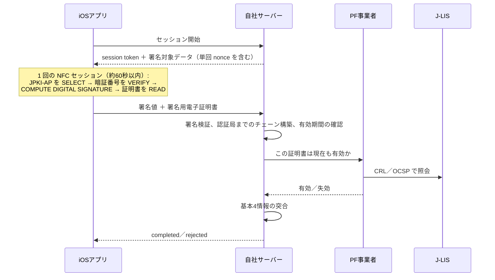

# ekyc-jp

[English](README.en.md) · **日本語**

マイナンバーカード／公的個人認証（JPKI）による本人確認（eKYC）を、iOS アプリとその検証サーバーに
実装するための Claude Code プラグインです（19 スキル）。アプリはベンダー SDK を使わず、CoreNFC と
APDU で IC チップを直接読み取る構成を前提にしています。

導入すると、Claude Code は「それらしい推測」ではなく仕様と法令に基づいて回答します。確認できていない
値は、その旨を明示します。

## できること

- **法的に有効な本人確認方法を選ぶ** — 犯収法・携帯法・古物営業法。2027年4月の犯収法改正にも対応。
- **CoreNFC の設定** — entitlement、`Info.plist` の AID 列挙、セッションのライフサイクル、APDU 送受信。
- **署名用電子証明書の読み取りと電子署名** — サーバーが渡すデータへの署名（6〜16 桁の英数字暗証番号）。
- **繰り返しのログイン** — 利用者証明用電子証明書（4 桁暗証番号）によるチャレンジレスポンス。
- **券面情報の読み取り** — 基本4情報のテキスト、券面イメージ、IC 内の顔写真、個人番号（番号法上の義務を含む）。
- **暗証番号ロックと NFC エラーへの対応** — 残り回数、SW1SW2、日本語のエラー文言、アンテナ位置。
- **サーバーでの JPKI 署名検証**（厳格な PKCS#1 v1.5、J-LIS の認証局までのチェーン検証）と、
  PF事業者経由の**失効確認**。
- **サーバー側の設計** — セッションの状態遷移、nonce、リプレイ対策、同意情報の管理。

**対象読者:** 日本向けサービスで eKYC を実装する iOS／バックエンドエンジニア、テックリード。

**これは何ではないか:**

- **ライブラリではありません。** 知識と手順の集まりです。Swift や APDU のコード片は判断を具体化するためのものです。
- **法的助言ではありません。** 法令の記述は作業用のマップです。法務担当と一次資料で必ず確認してください。
- **認定事業者を迂回する手段ではありません。** J-LIS へ直接照会するよう案内するスキルはありません。
- **容貌撮影・liveness の実装ではありません。** ヘ方式（IC 読取＋容貌撮影）のカメラ部分は対象外です。PF事業者の SDK を使ってください。

## 概要

| | |
|---|---|
| プラグイン | `ekyc-jp` v0.1.0 · 19 スキル · 知識と手順のみ |
| 記述言語 | 日本語（`SKILL.md`）。各スキルに英語の参考訳 `SKILL.en.md` があるが、Claude Code は読み込まない |
| 品質確認 | `claude plugin validate` パス · `claude plugin eval` のトリガー検証 115 件 |
| 最終レビュー | 2026-09-25 |
| ライセンス | [MIT](LICENSE)（第三者資料を除く。[ライセンス](#ライセンス) 参照） |

## 30 秒でわかる用語

- **JPKI（公的個人認証サービス）**: マイナンバーカードの IC チップに 2 つの鍵ペアを持つ公開鍵基盤。
- **署名用電子証明書**: 氏名・住所・生年月日・性別（基本4情報）を含む。本人確認（身元確認）に使う。
- **利用者証明用電子証明書**: 個人属性を含まない。ログイン（当人認証）専用。
- **J-LIS（地方公共団体情報システム機構）**: カードの発行者であり認証局。トラストアンカー。
- **PF事業者（プラットフォーム事業者）**: 主務大臣認定を受け、J-LIS への有効性確認を代行する事業者。
  民間事業者は J-LIS へ直接照会できない。

その他の用語は [`references/yougoshuu.md`](references/yougoshuu.md)（約 90 語）を参照してください。

## インストール

このリポジトリ自体がプラグインです（ルートに `.claude-plugin/plugin.json`）。マーケットプレイスへの
登録は**まだ公開していない**ため、`claude plugin marketplace add …` は使えません。ローカルに
clone して読み込みます。

```bash
git clone git@github.com:haphanquang/jp-ekyc-ios-agent-skills.git

# 方法A（推奨）: セッション単位でプラグインとして読み込む
claude --plugin-dir ./jp-ekyc-ios-agent-skills

# 方法B: 個人スキルとしてシンボリックリンクを張る
ln -s "$PWD"/jp-ekyc-ios-agent-skills/skills/* ~/.claude/skills/
```

方法A のほうが確実です。各スキルはリポジトリルートからの相対パスで `references/` を参照しており、
方法B ではスキルだけがリンクされます。

検証: `claude plugin validate ./jp-ekyc-ios-agent-skills`

## 試してみる

質問は日本語でも英語でも、普通の言葉で構いません。どこから始めればよいか分からないときは、
ルーターの **`ekyc-jp`** が適切なスキルへ案内します。

| 質問の例 | 回答するスキル |
|---|---|
| 「2027年4月以降、オンラインの口座開設で使える本人確認方法は？」 | `honnin-kakunin-houhou` |
| 「CoreNFC で署名用暗証番号を VERIFY し、サーバーのハッシュに署名して、署名用電子証明書を読むコードを書いて」 | `jpki-ap-shomei`（＋ `ios-corenfc-apdu`） |
| 「アプリから署名値と証明書が届いた。サーバーでどう検証すればいい？」 | `signature-verification` → `jlis-yukousei-kakunin` |

## 19 のスキル

### 層1 — 業務・法務（何をしてよいか）

| スキル | 用途 |
|---|---|
| `jpki-overview` | JPKI の全体像：登場人物、信頼モデル、手数料 |
| `honnin-kakunin-houhou` | どの本人確認方法が使えるか、2026／2027 年の法改正。**方法名と施行時期の定義元** |
| `mynumber-card-ic` | IC チップの AP 一覧：取得できるデータ、必要な暗証番号、ロック回数 |
| `kihon-4-jouhou-doui` | 基本4情報、最新4情報提供サービス、同意画面の要件 |
| `platform-jigyousha` | PF事業者が必要な理由、CRL 方式と OCSP 方式、事業者選定、導入手続き |

### 層2 — iOS 実装（どうカードを読むか）

| スキル | 用途 |
|---|---|
| `ios-corenfc-apdu` | Xcode 設定、`NFCTagReaderSession`、APDU 送受信、約 60 秒のセッション上限 |
| `jpki-ap-shomei` | 署名用電子証明書：暗証番号の VERIFY、サーバー提供ハッシュへの署名、証明書の READ |
| `jpki-ap-riyousha` | 利用者証明用電子証明書：チャレンジレスポンスによるログイン |
| `kenmen-nyuryoku-hojo-ap` | 基本4情報をテキストで取得（ヘ方式向け） |
| `kenmen-jikou-kakunin-ap` | 券面イメージ、IC 内の顔写真、個人番号の取得 |
| `pin-lock-handling` | 暗証番号の試行回数、SW1SW2、ロック時の UX、ロック解除の案内 |
| `ios-nfc-ux-errors` | 日本語のエラー文言、アンテナ位置、App Clip によるインストール不要フロー |
| `ios-security` | 端末内のデータ取り扱い、証明書ピンニング、ログ禁止項目 |

### 層3 — サーバー／連携（どう検証するか）

| スキル | 用途 |
|---|---|
| `signature-verification` | 署名検証、J-LIS の認証局までのチェーン構築、基本4情報の突合 |
| `jlis-yukousei-kakunin` | PF事業者経由の失効確認。確認できなければ fail closed |
| `ekyc-session-orchestration` | セッションの状態遷移、nonce、リプレイ・中継対策、冪等性 |
| `doui-jouhou-kanri` | 同意情報の保存と管理（有効期間 10 年、取消し、開示請求） |

### ルーターと保守

| スキル | 用途 |
|---|---|
| `ekyc-jp` | 入口。「やりたいこと → スキル」の対応表と、下記 5 つのルール |
| `sources-refresh` | 一次資料と法令リビジョンを再取得し、影響するスキルを列挙。スキル本文は編集しない |

## JPKI 署名による本人確認の流れ



署名が暗号的に正しくても、証明書が現在も有効とは限りません。PF事業者経由の失効確認が通って初めて
「確認済み」とし、確認できなかった場合は拒否します（fail closed）。

## すべてのスキルが守るルール

ルーターが示す 5 つの不変のルールです。

1. **J-LIS へ直接照会しない。** 電子証明書の有効性確認は必ず PF事業者経由で行う。
2. **法令の方法名・時期の定義元は 1 か所。** 断定してよいのは `honnin-kakunin-houhou` と
   [`references/method-map.md`](references/method-map.md) だけ。
3. **時期に関わる質問の前に資料を更新する。** `references/sources.md` が約 3 か月以上古いとき、
   または 2026／2027 年の時期に関わる質問のときは、先に `sources-refresh` を実行する。
4. **暗証番号はカードへの VERIFY にだけ渡す。** サーバー・ログへ送らず、端末にも保存しない。
5. **電子証明書は JPKI の認証局までチェーン検証してから信用する。** 証明書内の公開鍵で署名が
   通るだけでは何も証明しない。

各スキルの末尾には `## 出典`・`## 最終確認日`・`## 未確認事項` があります。JPKI の技術仕様は
J-LIS から守秘契約付きで配布されるため、公開資料で確認できない値（券面系 AP の AID、一部の
SW1SW2 の意味など）は推測せず `未確認` と明記しています。

## 本人確認方法マップ（要約）

本プラグインの推奨は次のとおりです。

- **主経路:** JPKI 署名方式（カード読み取り＋電子署名）。自社が署名検証者の要件を満たす必要がある。
- **フォールバック:** IC 読取（基本4情報＋IC 内顔写真）＋容貌撮影。
- **ウォレット:** スマートフォン搭載マイナンバーカード（iOS で利用可能になり次第）。

| 変更 | 施行 |
|---|---|
| 携帯法：書類画像送信方式の廃止 | 2026-04-01 施行済み（経過措置は 2026-09-30 まで） |
| 基本4情報へのカナ氏名の追加 | 2026-05-26 |
| 犯収法：画像送信方式の廃止、号記号の再編 | 2027-04-01 |

詳細: `honnin-kakunin-houhou`、[`method-map.md`](references/method-map.md)、[`hourei-eKYC.md`](references/hourei-eKYC.md)

## 参照ファイル

| パス | 内容 |
|---|---|
| [`references/method-map.md`](references/method-map.md) | 本人確認方法の対応表（現行・2027年版） |
| [`references/hourei-eKYC.md`](references/hourei-eKYC.md) | e-Gov から取得した条文抜粋とリビジョン ID |
| [`references/apdu-cheatsheet.md`](references/apdu-cheatsheet.md) | AID・EF 識別子・APDU・SW1SW2 の早見表（各値に確度マーカー付き） |
| [`references/yougoshuu.md`](references/yougoshuu.md) | 用語集（約 90 語） |
| [`references/sources.md`](references/sources.md) | 出典一覧：URL、取得日、ハッシュ、引用しているスキル |
| `references/refresh.sh` | `sources-refresh` が使う再取得スクリプト。一次資料の PDF 33 点を `references/pdfs/` に取得する |
| [`evals/`](evals/README.md) | トリガー検証 115 件（スキルごとに発火すべき 4 件、発火すべきでない 2 件） |

## 最新化

法令と一次資料は変わります。時期に関わる回答に頼る前に、Claude Code に「sources-refresh スキルを
使って」と依頼するか、`bash references/refresh.sh` を実行してください。変更のあった資料と法令
リビジョンが報告されます。どのスキルに反映するかは人が判断します。

トリガー検証はリポジトリルートで実行します（`claude plugin eval` はアーリーアクセス）:
`claude plugin eval . --ablation with-without`

## コントリビュート

- 法令事実の修正は `references/method-map.md` と `honnin-kakunin-houhou` に同時に反映する。
- 新しい APDU・AID・暗証番号の値には一次資料（J-LIS、デジタル庁、総務省、e-Gov）か、独立した
  信頼できる 2 ソースが必要。満たさなければ `未確認` のままにする。
- スキルは日本語で書き、末尾の 3 セクションを保ち、`claude plugin validate .` を通す。

## 免責事項・出典

現状有姿で提供する技術リファレンスです。**法務・セキュリティ・コンプライアンス上の助言ではありません。**
本番投入の前に、すべての要件を一次資料で確認してください。`未確認` と記した項目は意図的に未確認と
しています。著者はデジタル庁、総務省、J-LIS、およびいずれの PF事業者とも関係がありません。

デジタル庁、総務省、J-LIS、警察庁（JAFIC）、金融庁、e-Gov 法令検索が公開する資料とベンダー資料に
基づいています。各スキルの `## 出典` に依拠した資料を記載しています。一次資料の PDF 33 点は第三者の
資料であり、著作権は各発行者に帰属するため、本リポジトリには含めていません。URL と SHA256 は
[`references/sources.md`](references/sources.md) にあり、`bash references/refresh.sh` で
`references/pdfs/` に取得できます。

## ライセンス

本プロジェクトのために書いたスキル・リファレンス・評価ケース・コード例は [MIT License](LICENSE)
（© 2026 Phan Quang Ha）で公開しています。商用・クローズドソースのアプリでも利用できます。
プラグイン自体を再配布するときは著作権表示を残してください。

次のものは MIT License の対象外です。

- **`references/jpki-introduction.ja.md`**: デジタル庁のページの写しで、同サイトの利用規約に従います。
- **[`references/hourei-eKYC.md`](references/hourei-eKYC.md) に引用した法令本文**: 法令は著作権の目的と
  なりません（著作権法第13条）。

MIT License が及ぶのは本リポジトリの文章とコードだけです。JPKI・マイナンバーカード・PF事業者の
サービスに関する権利を与えるものではなく、本資料を法的助言にするものでもありません
（[免責事項・出典](#免責事項出典) 参照）。
